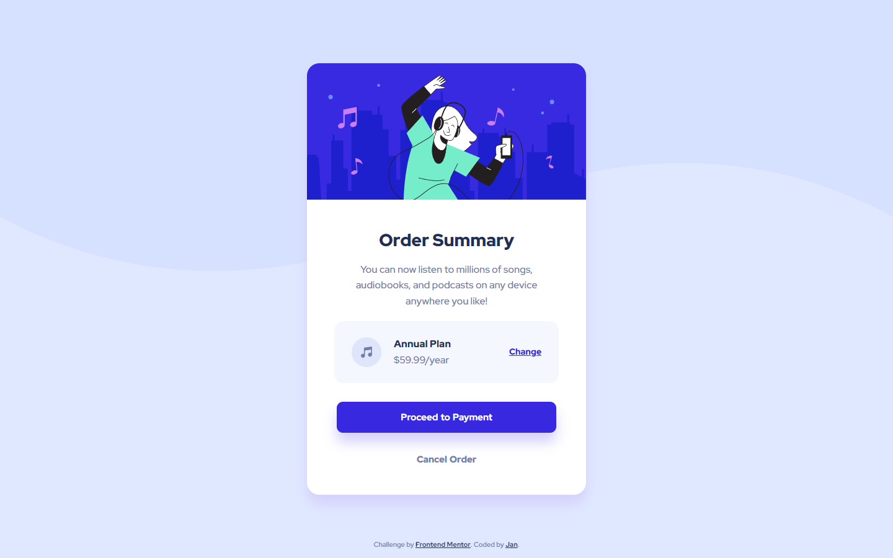
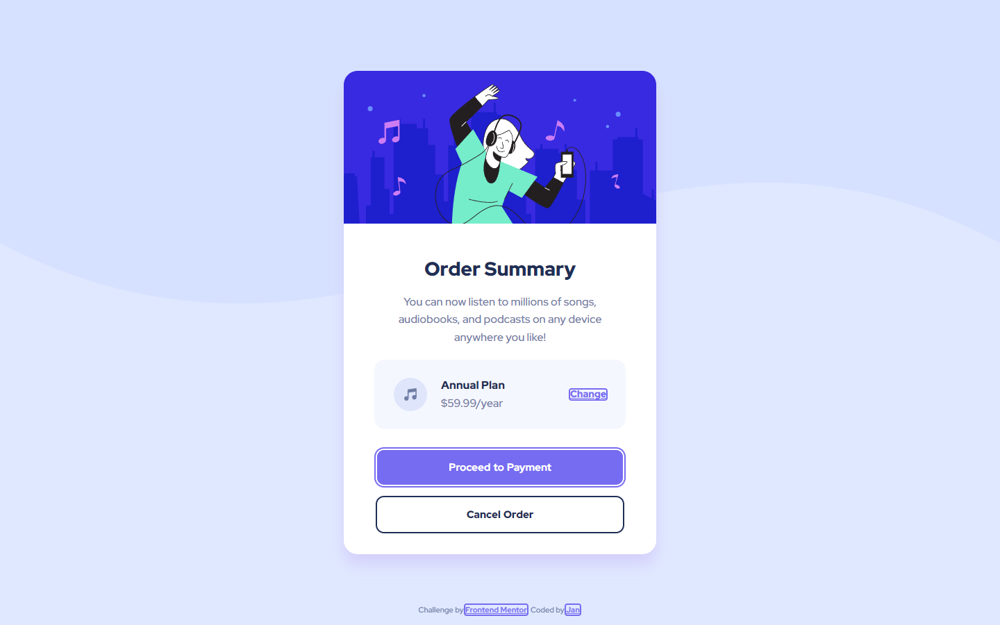

# Frontend Mentor - Order summary card solution

This is a solution to the [Order summary card challenge on Frontend Mentor](https://www.frontendmentor.io/challenges/order-summary-component-QlPmajDUj). Frontend Mentor challenges help you improve your coding skills by building realistic projects. 

## Table of contents

- [Overview](#overview)
  - [The challenge](#the-challenge)
  - [Screenshot](#screenshot)
  - [Links](#links)
- [My process](#my-process)
  - [Built with](#built-with)
  - [What I learned](#what-i-learned)
  - [Continued development](#continued-development)
  - [Useful resources](#useful-resources)
- [Author](#author)
- [Acknowledgments](#acknowledgments)

## Overview

### The challenge

Users should be able to:

- See hover states for interactive elements

### Screenshot

|  |  | | |
| ------- | ------- | -------| ------|
| Mobile  | Desktop | Hover  | Focus |

### Links

- Solution URL: [Github Repo](https://github.com/Negligence/order-summary-component)
- Live Site URL: [Github Pages](https://negligence.github.io/order-summary-component/)

## My process

### Built with

- Semantic HTML5 markup
- CSS custom properties
- CSS Grid
- Mobile-first workflow
- [Fluid Type Scale Calculator](https://utopia.fyi/type/calculator/) - Responsive Sizing Using Clamps

### What I learned

I used a section instead of a div for the change plan area of the card because there was a heading inside. Not really sure if I made the right call or if I should have just used a normal div and used both paragraphs tags for the text instead. Feel free to send me feedback if my tag usage is incorrect.

```html
<body>

  <main>

    <article>

      
      
      <h1>Order Summary</h1>
      <p>
        You can now listen to millions of songs, audiobooks, and podcasts on any
        device anywhere you like!
      </p>

      <section>
        
        <h2>Annual Plan</h2>
        <p>$59.99/year</p>
        <a href="#" role="button">Change</a>
      </section>

      <a href="#">Proceed to Payment</a>
      <a href="#">Cancel Order</a>

    </article>

  </main>
  
  <footer>
    Challenge by <a href="https://www.frontendmentor.io/challenges/order-summary-component-QlPmajDUj/hub/order-summary-component-SyHi0sOzc" target="_blank">Frontend Mentor</a>. 
    Coded by <a href="https://www.facebook.com/jan.panado/" target="_blank">Jan</a>.
  </footer>

</body>
```

Used the grid property shorthand on both my article and section area so I can have fine control for the element spacing inside the card. I like it because I can easily visualize the grid I'm making with the grid-area names and you can also set the grid-template-columns and grid-template-rows in one go. All that's left is to set the grid-area on the child elements so it'll got in the appropriate grid-area name I set.

I also liberally used clamps from fluid type scale to set a minimum and maximum on a lot of element sizing.
```css
/* #region Styling */
body {
  height: inherit;
  place-items: center;
  display: grid;
  gap: clamp(1.00rem, calc(0.83rem + 0.73vw), 2.00rem);
  background-image: url(../images/pattern-background-mobile.svg);
  background-color: var(--pale-blue);
  background-repeat: repeat-x;
}

@media only screen and (min-width:376px) {
  body {
    background-image: url(../images/pattern-background-desktop.svg);
  }
}

article {
  background: white;
  width: clamp(20.44rem, calc(17.73rem + 11.55vw), 28.13rem);
  height: max-content;
  border-radius: 1.25rem;
  box-shadow: 0 0.938rem 1.25rem 0 hsl(245, 83%, 90%);
  overflow: hidden;
  display: grid;
  justify-items: center;
  grid: 
  "   img  img  img   " 
  "    .    .    .    " clamp(2.25rem, calc(1.90rem + 1.50vw), 3.25rem)
  "    .    h1   .    " 
  "    .    .    .    " 1.25rem
  "    .    p    .    "
  "    .    .    .    " clamp(1.25rem, calc(1.59rem + -0.38vw), 1.50rem)
  "    .   sec   .    "
  "    .    .    .    " clamp(1.50rem, calc(1.37rem + 0.56vw), 1.88rem)
  "    .   pay   .    "
  "    .    .    .    " clamp(0.63rem, calc(0.45rem + 0.75vw), 1.13rem)
  "    .   back  .    "
  "    .    .    .    " clamp(1.00rem, calc(0.65rem + 1.50vw), 2.00rem)
  /   auto  1fr  auto;
}

article > img {
  object-fit: cover;
  width: 100%;
  height: clamp(10.00rem, calc(8.68rem + 5.63vw), 13.75rem);
  grid-area: img;
}

article > *:not(img) {
  text-align: center;
}

article > h1 {
  grid-area: h1;
  font-size: clamp(1.38rem, calc(1.24rem + 0.56vw), 1.75rem);
}

article > p {
  grid-area: p;
  width: clamp(16.25rem, calc(14.60rem + 7.04vw), 20.94rem);
  font-size:clamp(0.94rem, calc(0.92rem + 0.09vw), 1.00rem);
  line-height: 1.6em;
}

  /* #region Music Plans */
  section {
    grid-area: sec;
    width: clamp(17.44rem, calc(15.61rem + 7.79vw), 22.63rem);
    height: clamp(5.13rem, calc(4.73rem + 1.69vw), 6.25rem);
    border-radius: 0.938rem;
    background: var(--very-pale-blue);
    display: grid;
    grid:
    "    icon    plan   btn    "
    "    icon    sub    btn    "
    /    auto    2fr    1fr;
    justify-items: start;
    align-items: center;
    row-gap: clamp(0.50rem, calc(0.46rem + 0.19vw), 0.63rem);
    column-gap: 1.25rem;
    padding: 1rem clamp(1.00rem, calc(0.74rem + 1.13vw), 1.75rem);
  }

  section > img {
    grid-area: icon;
  }

  section > h2,
  section > p {
    line-height: 1em;
  }

  section > h2 {
    grid-area: plan;
    align-self: end;
    font-size: clamp(0.88rem, calc(0.83rem + 0.19vw), 1.00rem);
    font-weight: var(--fw-title);
  }
  
  section > p {
    grid-area: sub;
    align-self: start;
    font-size: clamp(0.88rem, calc(0.83rem + 0.19vw), 1.00rem);
    font-weight: var(--fw-reg);
  }

  section > a {
    grid-area: btn;
    justify-self: end;
    font-size: clamp(0.81rem, calc(0.79rem + 0.09vw), 0.88rem);
    font-weight: var(--fw-title);
    color: var(--bright-blue);
  }
  /* #endregion Music Plans */
  
  article > a {
    width: clamp(17.44rem, calc(15.79rem + 7.04vw), 22.13rem);
    height: 3.125rem;
    border-radius: 0.625rem;
    display: grid;
    align-items: center;
    text-decoration: none;
    word-spacing: 0.063rem;
    font-size: 0.938rem;
  }
  
  article > a:first-of-type {
    grid-area: pay;
    background-color: var(--bright-blue);
    box-shadow: 0 0.938rem 1.25rem 0 hsl(245, 83%, 90%);
    color: white;
  }
  
  article > a:last-of-type {
    grid-area: back;
    color: var(--desaturated-blue);
    font-weight: var(--fw-title);
  }
  
  footer {
    font-size: 0.6875rem;
    position: fixed;
    inset: auto 0 1rem;
    text-align: center;
}
/* #endregion Styling */
```

If anyone wants to use the card and duplicate it for whatever reason, I have also put some media queries below that will convert it to a multi-card layout. Simply uncomment the code and it will create a multi-column layout at different viewports.

The number of dots represent the maximumn number of columns, you can customize the amount of columns by changing the number of dots. If you wish to customize the condition of when it will change columns, change the "min-width: pixel value;" instead.

```css
/* #region Multiple Card Layout */
/* Uncomment Code if you have multiple articles */

/* body main {
  display: contents;
}

@media only screen and (min-width:820px) {
  body {
    height: max-content;
    place-content: center;
    padding: 3rem;
    grid-template-areas: "    .     .    ";
  }
}

@media only screen and (min-width:1420px) {
  body {
    grid-template-areas: "    .     .     .     ";
  }
}

@media only screen and (min-width:2000px) {
  body {
    grid-template-areas: "    .     .     .     .     ";
  }
}

@media only screen and (min-width:2560px) {
  body {
    grid-template-areas: "    .     .     .     .     .     ";
  }
} */

/* #endregion Multiple Card Layout */
```
### Continued development

I will probably try to learn SASS after this to simplify the way I generate the clamps that I need. Instead of the longhand that is used in vanilla CSS:
```css
p {
  font-size: clamp(1rem, 0.5vw + 0.88rem, 1.19rem);
}
```
The SASS code would be shortened and easier to understand with a minimum and a maximum size:
```css
p {
  font-size: font-size: clamped(16px, 19px);
}
```

### Useful resources

- [3 modern CSS techniques for responsive design](https://www.youtube.com/watch?v=VsNAuGkCpQU) - Really Helpful video that gives you modern css sizing techniques.
- [Fluid Type Scale Calculator](https://utopia.fyi/type/calculator) - This helped me out a lot with creating responsive elements, lessened the use of media queries and used clamps instead.
- [Creating a Fluid Type Scale with CSS Clamp](https://www.aleksandrhovhannisyan.com/blog/fluid-type-scale-with-css-clamp/) - An article that explains how the fluid type scale calculator computes the preferred size for clamps.
- [Neko Calc Px to Rem Converter](https://nekocalc.com/px-to-rem-converter) - A wonderfully helpful tool that converts pixels to rem values so the document will follow whenever the user scales their browser font-size.

## Author

- Frontend Mentor - [@Negligence](https://www.frontendmentor.io/profile/Negligence)
- Github - [Negligence](https://github.com/Negligence)
- Twitter - [@IEImNothing](https://twitter.com/IEImNothing)
- Twitch - [Arrogant_Negligence](https://www.twitch.tv/arrogant_negligence)
- Youtube - [Jan Panado](https://www.youtube.com/channel/UC4ojhHYmkHptu2JpyKtrL-w)
- LinkedIn - [Jan Panado](https://www.linkedin.com/in/janp-09/)
- Facebook - [Jan Panado](https://www.facebook.com/jan.panado)
- Website - [Jan Panado](https://jan-panado.com/)

## Acknowledgments

Shout out to [Kevin Powell](https://www.youtube.com/kepowob), his videos often give out helpful sizing alternatives for CSS.
